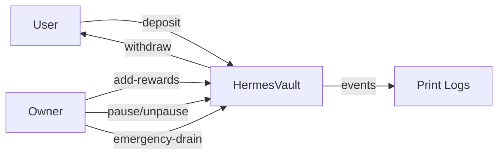
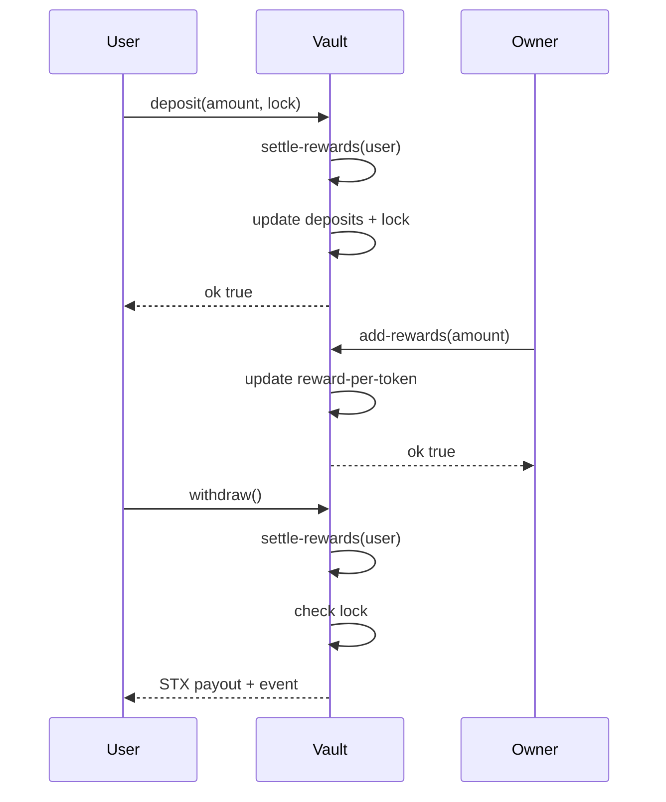
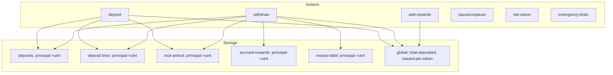

# HermesVault

HermesVault is a Clarity smart contract that accepts STX deposits with lock periods and distributes rewards on withdrawal. It includes owner controls (pause, owner rotation, emergency drain) and on-chain events for operational visibility.

## Table of contents

1. Overview
2. Contracts
3. Architecture
4. System flow
5. Design drawing
6. Core behavior
7. Owner controls
8. Events
9. Errors
10. Testing
11. Deployment notes

## 1. Overview

Users deposit STX with a chosen lock period. The vault tracks deposits per account and calculates rewards using a reward-per-token accumulator. Rewards are funded by the owner via `add-rewards` and paid out on withdrawal. The contract enforces lock periods and supports pause/unpause for incident response.

## 2. Contracts

- `contracts/hermesvaultv3.clar` (Clarity v3)

## 3. Architecture



## 4. System flow



## 5. Design drawing



## 6. Core behavior

### Deposits

- Validates amount and lock choice.
- Transfers STX to the contract.
- Updates per-user maps and totals.
- Emits a `deposit` print event.

### Withdrawals

- Requires an active deposit and lock expiration.
- Settles rewards and applies a lock-based multiplier.
- Transfers principal + rewards from the vault.
- Resets user state.
- Emits a `withdraw` print event.

### Rewards

- Rewards are funded by the owner via `add-rewards`.
- `reward-per-token` distributes rewards proportional to deposits.
- `settle-rewards` snapshots per-user accrual on state changes.

## 7. Owner controls

- `set-owner(new-owner)` rotates control to a new principal.
- `pause()` and `unpause()` prevent deposits and withdrawals.
- `emergency-drain()` withdraws all STX to the current owner.

## 8. Events

Print events are emitted for:

- `deposit`
- `withdraw`
- `add-rewards`
- `pause` / `unpause`
- `set-owner`
- `emergency-drain`

These are useful for indexers and operational monitoring.

## 9. Errors

- `ERR_INVALID_AMOUNT` (u101)
- `ERR_NOT_OWNER` (u102)
- `ERR_NO_DEPOSIT` (u103)
- `ERR_INVALID_LOCK` (u104)
- `ERR_LOCKED` (u105)
- `ERR_PAUSED` (u106)
- `ERR_INVALID_OWNER` (u107)

## 10. Testing

```bash
npm install
npm test
```

The test suite covers deposits, withdrawals, lock enforcement, reward distribution, owner controls, and pause behavior.

## 11. Deployment notes

- Use Clarity v3 on mainnet to keep `as-contract` support.
- Ensure your deployment plan uses `clarity_version = 3`.
- Confirm the contract name matches the principal literal in `CONTRACT_PRINCIPAL`.
